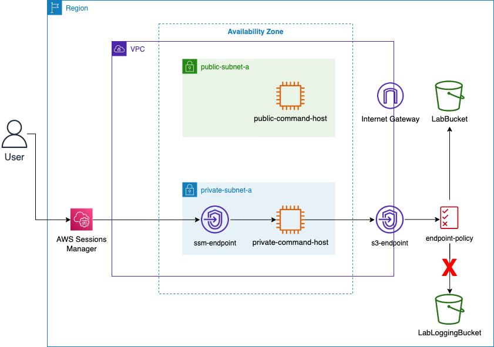

# Advanced Architecting on AWS Labs

This repository contains AWS CDK code for the labs in the "Advanced Architecting on AWS" course. Each lab is implemented as a separate stack in the `src/stacks` directory.

## Lab 1: Securing Amazon S3 VPC Endpoint Communications

### Lab overview

Data security is crucial and should always be your first priority. Amazon Web Services (AWS) offers several solutions and best practices to help secure your data. Understanding how to make the best decisions to secure your data can be challenging. Running applications in private subnets, which have no route to the internet, provides data security by limiting the attack surface to only internal traffic. This strategy is a great security measure.However, it can cause problems when your application must access data from services such as Amazon Simple Storage Service (Amazon S3).

To solve this problem, AWS provides Amazon Virtual Private Cloud (Amazon VPC) endpoints. With a VPC endpoint, you can privately connect your VPC to supported AWS services. This private connection is possible without requiring an internet gateway, a NAT gateway, a VPN connection, or an AWS Direct Connect connection. Communication through the VPC endpoint does not require resources in your VPC to have public IP addresses. Thus, traffic through your VPC endpoint can stay within the Amazon network.

In this lab, you create VPC endpoints. You then use these endpoints to access Amazon S3 from an Amazon Elastic Compute Cloud (Amazon EC2) instance that is located in a private subnet. To further improve data security, you create a VPC endpoint policy to restrict use of the endpoint to specific resources.

### Objectives

After completing this lab, you will be able to:

- Understand private and public subnets and why they can or cannot communicate with Amazon S3.
- Configure VPC endpoints using the AWS Management Console and AWS Command Line Interface (AWS CLI).
- Interact with Amazon S3 through a VPC endpoint in a private subnet.
- Create a VPC endpoint policy to restrict resource access.

## Lab 2: Configuring Transit Gateways

### Lab overview

You can connect Amazon Virtual Private Cloud (Amazon VPC) pairs using peering. However, managing point-to-point connectivity across many Amazon VPCs, without the ability to centrally manage the connectivity policies, can be operationally costly and cumbersome. For on-premises connectivity, you need to attach your AWS VPN to each individual Amazon VPC. This solution can be time-consuming to build and hard to manage when the number of VPCs grows into the hundreds.

With AWS Transit Gateway, you only have to create and manage a single connection from the central gateway to each VPC, on-premises data center, or remote office across your network. A transit gateway acts as a hub that controls how traffic is routed among all the connected networks, which act like spokes. This hub-and-spoke model significantly simplifies management and reduces operational costs because each network only has to connect to the transit gateway and not to every other network. Connect any new VPC to the transit gateway, and the VPC is then automatically available to every other network that is connected to the transit gateway. This ease of connectivity simplifies the ability to scale your network as you grow.

In this lab, you build and configure routing via transit gateways with multiple levels of complexity. You start by inspecting existing VPCs, subnets, route tables, and Amazon Elastic Compute Cloud (Amazon EC2) instances. You then create a transit gateway and attach four existing VPCs to the gateway. You investigate the default route table on the transit gateway, which allows all-all communication between VPCs attached to the transit gateway. After confirming a functional transit gateway, you then modify the route tables on the transit gateway to isolate communication between specific VPCs. Lastly, you peer two transit gateways across regional boundaries to show how you can configure a global network with transit gateways.

The ability to peer transit gateways between different AWS Regions enables customers to extend this connectivity and build global networks spanning multiple AWS Regions. Traffic using inter-region transit gateway peering always stays on the AWS global network and never traverses the public internet. This reduces threat vectors, such as common exploits and distributed denial of service (DDoS) attacks. Inter-region transit gateway peering encrypts inter-region traffic with no single point of failure.

### Objectives

After completing this lab, you will be able to:

- Configure a transit gateway
- Attach VPCs to a transit gateway
- Control and customize routing with AWS Transit Gateway
- Peer transit gateways between two Regions
- Use Network Manager to visualize and analyze your network

## Lab 3: Deploying an Application with Amazon ECS on Fargate

## Lab 4: Setting Up a Data Lake with Lake Formation

## Lab 5: Migrating an On-Premises NFS Share Using AWS DataSync and Storage Gateway
